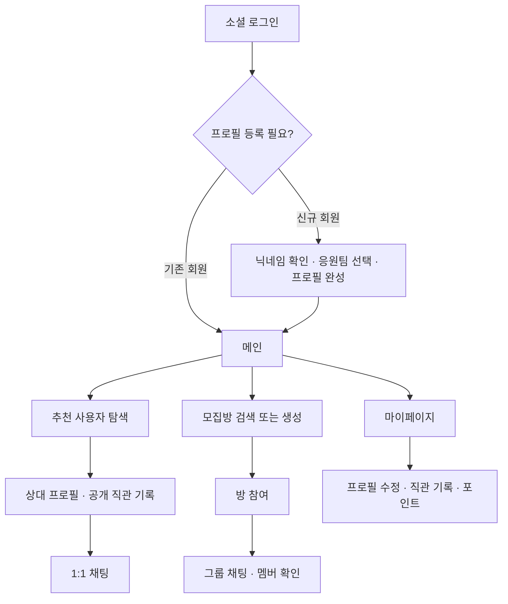

# jikchin-android

```mermaid
flowchart TD
    A["소셜 로그인"] --> B{"프로필 등록 필요?"}
    B -->|신규 회원| C["닉네임 확인 · 응원팀 선택 · 프로필 완성"]
    B -->|기존 회원| D["메인"]
    C --> D

    D --> E["추천 사용자 탐색"]
    E --> F["상대 프로필 · 공개 직관 기록"]
    F --> G["1:1 채팅"]

    D --> H["모집방 검색 또는 생성"]
    H --> I["방 참여"]
    I --> J["그룹 채팅 · 멤버 확인"]

    D --> K["마이페이지"]
    K --> L["프로필 수정 · 직관 기록 · 포인트"]
```
